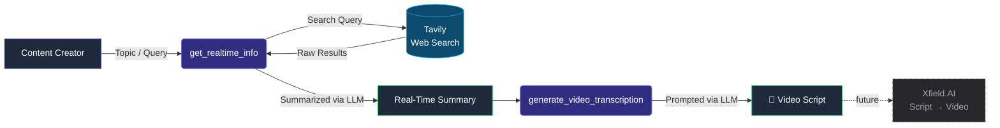

# 🎬 StoryForge AI

**An intelligent MCP-based content creation agent that turns any topic into a ready-to-shoot video script.**

StoryForge AI researches a topic in real time, distills it into a clear narrative, and writes a structured video script complete with hook, tone, and call-to-action — built for YouTube Shorts, Reels, and social video creators who want to skip the blank-page problem.

<p align="center">
  
  
  
  
  
  
  
</p>

---

## What It Does

Most script-writing tools either hallucinate facts or produce generic, robotic copy. StoryForge AI fixes both problems by separating **research** from **writing**:

1. It searches the live web for current, accurate information on your topic
2. It distills that research into a clean, human-readable summary
3. It hands that summary to a second pass focused purely on **storytelling** — hook, pacing, tone, and a call-to-action

The result is a script that's both factually grounded and built to hold attention.

---

## Architecture



Exposed as **two MCP tools**, so any MCP-compatible client (Claude Desktop, custom agents, etc.) can call them directly:

| Tool | Description |
|---|---|
| `get_latest_info_mcp(query)` | Returns a real-time, web-grounded summary of any topic |
| `get_video_script_mcp(query)` | Runs the full pipeline — research **and** script generation — in one call |

---

## Tech Stack

| Layer | Technology |
|---|---|
| Agent Protocol | [MCP](https://modelcontextprotocol.io) (`FastMCP`) |
| LLM | Groq (`llama-3.3-70b-versatile`) |
| Real-Time Search | [Tavily](https://tavily.com) |
| Orchestration | LangChain |
| UI (standalone mode) | Streamlit |
| Package Management | `uv` |

---

## Project Structure

```
StoryForge-Agent-MCP-Server/
├── app.py             # Core logic: research + script generation, Streamlit UI
├── mcp_server.py       # MCP server exposing the agent as callable tools
├── requirements.txt     # Python dependencies
├── pyproject.toml       # Project metadata (uv)
├── .env.example         # Required environment variables (template)
└── README.md
```

---

## Getting Started

### 1. Clone the repo
```bash
git clone https://github.com/Souradeep-ghosh/StoryForge-Agent-MCP-Server.git
cd StoryForge-Agent-MCP-Server
```

### 2. Install dependencies
```bash
pip install -r requirements.txt
# or, if using uv:
uv sync
```

### 3. Configure environment variables
Copy the example file and add your own keys:
```bash
cp .env.example .env
```
```env
GROQ_API_KEY=your_groq_api_key
TAVILY_API_KEY=your_tavily_api_key
```

### 4. Run it

**As a standalone Streamlit app:**
```bash
streamlit run app.py
```

**As an MCP server** (for use with Claude Desktop or any MCP client):
```bash
python mcp_server.py
```

To connect it to Claude Desktop, add this to your `claude_desktop_config.json`:
```json
{
  "mcpServers": {
    "storyforge": {
      "command": "python",
      "args": ["/full/path/to/mcp_server.py"],
      "env": {
        "GROQ_API_KEY": "your_groq_api_key",
        "TAVILY_API_KEY": "your_tavily_api_key"
      }
    }
  }
}
```

---

## Example

**Input:**
```
"The James Webb telescope's latest discovery"
```

**Output (abridged):**
> 🪐 *"Three hundred million light-years away, astronomers just found something that shouldn't exist..."*
> A 100–120 word, hook-first script — paced for a 30–45 second Short, with a clear CTA at the end.

---

## Roadmap

- [x] Real-time research pipeline (Tavily + LLM summarization)
- [x] Video script generation with tone/structure prompting
- [x] MCP server exposing both stages as tools
- [ ] Script-to-video integration via **Xfield.AI**
- [ ] Tone/style presets (educational, comedic, dramatic, brand voice)
- [ ] Feedback loop — refine scripts based on user ratings
- [ ] FastAPI backend + React frontend for a full product experience

---

## Why MCP?

Wrapping the agent in MCP rather than a plain function call means StoryForge isn't locked into one chat UI — any MCP-compatible client can plug into the same research-and-write pipeline without rewriting the core logic. It's the same architectural bet as building a service behind an API instead of hardcoding it into a single app..

---

## License

Apache 2.0 — see [LICENSE](./LICENSE) for details.

---

<p align="center">
  Built by <a href="https://github.com/Souradeep-ghosh">Souradeep Ghosh</a> · part of an ongoing agentic AI portfolio
</p>